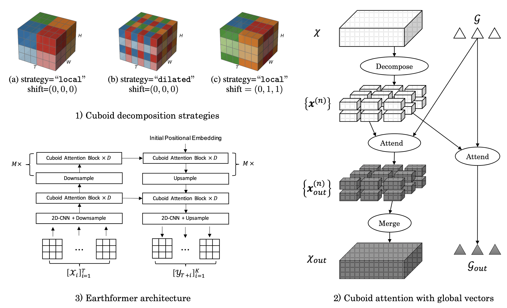
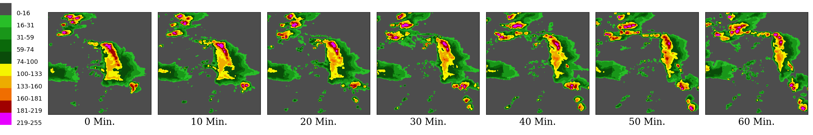

## Earthformer

[](https://paperswithcode.com/sota/weather-forecasting-on-sevir?p=earthformer-exploring-space-time-transformers)
[](https://paperswithcode.com/sota/earth-surface-forecasting-on-earthnet2021-iid?p=earthformer-exploring-space-time-transformers)
[](https://paperswithcode.com/sota/earth-surface-forecasting-on-earthnet2021-ood?p=earthformer-exploring-space-time-transformers)

By [Zhihan Gao](https://scholar.google.com/citations?user=P6ACUAUAAAAJ&hl=en), [Xingjian Shi](https://github.com/sxjscience), [Hao Wang](http://www.wanghao.in/), [Yi Zhu](https://bryanyzhu.github.io/), [Yuyang Wang](https://scholar.google.com/citations?user=IKUm624AAAAJ&hl=en), [Mu Li](https://github.com/mli), [Dit-Yan Yeung](https://scholar.google.com/citations?user=nEsOOx8AAAAJ&hl=en).

This repo is the official implementation of ["Earthformer: Exploring Space-Time Transformers for Earth System Forecasting"](https://www.amazon.science/publications/earthformer-exploring-space-time-transformers-for-earth-system-forecasting) that will appear in NeurIPS 2022. 

Check our [poster](https://earthformer.s3.amazonaws.com/docs/Earthformer_poster_NeurIPS22.pdf).

## Tutorials

- [Inference Tutorial of Earthformer on EarthNet2021](./scripts/cuboid_transformer/earthnet_w_meso/inference_tutorial_earthformer_earthnet2021.ipynb). [](https://studiolab.sagemaker.aws/import/github/amazon-science/earth-forecasting-transformer/blob/main/scripts/cuboid_transformer/earthnet_w_meso/inference_tutorial_earthformer_earthnet2021.ipynb) [](https://colab.research.google.com/github/amazon-science/earth-forecasting-transformer/blob/main/scripts/cuboid_transformer/earthnet_w_meso/inference_tutorial_earthformer_earthnet2021.ipynb)

## Introduction

Conventionally, Earth system (e.g., weather and climate) forecasting relies on numerical simulation with complex physical models and are hence both 
expensive in computation and demanding on domain expertise. With the explosive growth of the spatiotemporal Earth observation data in the past decade, 
data-driven models that apply Deep Learning (DL) are demonstrating impressive potential for various Earth system forecasting tasks. 
The Transformer as an emerging DL architecture, despite its broad success in other domains, has limited adoption in this area. 
In this paper, we propose **Earthformer**, a space-time Transformer for Earth system forecasting. 
Earthformer is based on a generic, flexible and efficient space-time attention block, named **Cuboid Attention**. 
The idea is to decompose the data into cuboids and apply cuboid-level self-attention in parallel. These cuboids are further connected with a collection of global vectors.

Earthformer achieves strong results in synthetic datasets like MovingMNIST and N-body MNIST dataset, and also outperforms non-Transformer models (like ConvLSTM, CNN-U-Net) in SEVIR (precipitation nowcasting) and ICAR-ENSO2021 (El Nino/Southern Oscillation forecasting).





### Cuboid Attention Illustration


## Installation
We recommend managing the environment through Anaconda. 

First, find out where CUDA is installed on your machine. It is usually under `/usr/local/cuda` or `/opt/cuda`. 

Next, check which version of CUDA you have installed on your machine:

```bash
nvcc --version
```

Then, create a new conda environment:

```bash
conda create -n earthformer python=3.9
conda activate earthformer
```

Lastly, install dependencies. For example, if you have CUDA 11.6 installed under `/usr/local/cuda`, run:

```bash
python3 -m pip install torch==1.12.1+cu116 torchvision==0.13.1+cu116 -f https://download.pytorch.org/whl/torch_stable.html
python3 -m pip install pytorch_lightning==1.6.4
python3 -m pip install xarray netcdf4 opencv-python earthnet==0.3.9
cd ROOT_DIR/earth-forecasting-transformer
python3 -m pip install -U -e . --no-build-isolation

# Install Apex
CUDA_HOME=/usr/local/cuda python3 -m pip install -v --no-cache-dir --global-option="--cpp_ext" --global-option="--cuda_ext" pytorch-extension git+https://github.com/NVIDIA/apex.git
```

If you have CUDA 11.7 installed under `/opt/cuda`, run:

```bash
python3 -m pip install torch==1.13.1+cu117 torchvision==0.14.1+cu117 -f https://download.pytorch.org/whl/torch_stable.html
python3 -m pip install pytorch_lightning==1.6.4
python3 -m pip install xarray netcdf4 opencv-python earthnet==0.3.9
cd ROOT_DIR/earth-forecasting-transformer
python3 -m pip install -U -e . --no-build-isolation

# Install Apex
CUDA_HOME=/opt/cuda python3 -m pip install -v --no-cache-dir --global-option="--cpp_ext" --global-option="--cuda_ext" pytorch-extension git+https://github.com/NVIDIA/apex.git
```

## Dataset
### MovingMNIST
We follow [*Unsupervised Learning of Video Representations using LSTMs (ICML2015)*](http://www.cs.toronto.edu/~nitish/unsup_video.pdf) to use [MovingMNIST](https://github.com/mansimov/unsupervised-videos) that contains 10,000 sequences each of length 20 showing 2 digits moving in a $64\times 64$ frame.

Our [MovingMNIST DataModule](src/earthformer/datasets/moving_mnist/moving_mnist.py) automatically downloads it to [datasets/moving_mnist](./datasets/moving_mnist).

### N-body MNIST
The underlying dynamics in the N-body MNIST dataset is governed by the Newton's law of universal gravitation:

$\frac{d^2\boldsymbol{x}\_{i}}{dt^2} = - \sum\_{j\neq i}\frac{G m\_j (\boldsymbol{x}\_{i}-\boldsymbol{x}\_{j})}{(\|\boldsymbol{x}\_i-\boldsymbol{x}\_j\|+d\_{\text{soft}})^r}$

where $\boldsymbol{x}\_{i}$ is the spatial coordinates of the $i$-th digit, $G$ is the gravitational constant, $m\_j$ is the mass of the $j$-th digit, $r$ is a constant representing the power scale in the gravitational law, $d\_{\text{soft}}$ is a small softening distance that ensures numerical stability.

The N-body MNIST dataset we used in the paper can be downloaded from https://earthformer.s3.amazonaws.com/nbody/nbody_paper.zip .

In addition, you can also use the following script for downloading / extracting the data:
```bash
cd ROOT_DIR/earth-forecasting-transformer
python ./scripts/datasets/nbody/download_nbody_paper.py
```

Alternatively, run the following commands to generate N-body MNIST dataset.
```bash
cd ROOT_DIR/earth-forecasting-transformer
python ./scripts/datasets/nbody/generate_nbody_dataset.py --cfg ./scripts/datasets/nbody/cfg.yaml
```

### SEVIR
[Storm EVent ImageRy (SEVIR) dataset](https://sevir.mit.edu/) is a spatiotemporally aligned dataset containing over 10,000 weather events.
We adopt NEXRAD Vertically Integrated Liquid (VIL) mosaics in SEVIR for benchmarking precipitation nowcasting, i.e., to predict the future VIL up to 60 minutes given 65 minutes context VIL. 
The resolution is thus $13\times 384\times 384\rightarrow 12\times 384\times 384$.

To download SEVIR dataset from AWS S3, run:
```bash
cd ROOT_DIR/earth-forecasting-transformer
python ./scripts/datasets/sevir/download_sevir.py --dataset sevir
```

A visualization example of SEVIR VIL sequence:


### ICAR-ENSO
ICAR-ENSO consists of historical climate observation and stimulation data provided by Institute for Climate and Application Research (ICAR). 
We forecast the SST anomalies up to 14 steps (2 steps more than one year for calculating three-month-moving-average),
given a context of 12 steps (one year) of SST anomalies observations.

To download the dataset, you need to follow the instructions on the [official website](https://tianchi.aliyun.com/dataset/dataDetail?dataId=98942). 
You can download a zip-file named `enso_round1_train_20210201.zip`. Put it under `./datasets/` and extract the zip file with the following command:

```bash
unzip datasets/enso_round1_train_20210201.zip -d datasets/icar_enso_2021
```

### EarthNet2021

You may follow the [official instructions](https://www.earthnet.tech/en21/ds-download/) for downloading [EarthNet2021 dataset](https://www.earthnet.tech/en21/ch-task/). 
We recommend download it via the [earthnet_toolket](https://github.com/earthnet2021/earthnet-toolkit).
```python
import earthnet as en
en.download(dataset="earthnet2021", splits="all", save_directory="./datasets/earthnet2021")
```
Alternatively, you may download [EarthNet2021x dataset](https://www.earthnet.tech/en21x/download/), which is the same as [EarthNet2021 dataset](https://www.earthnet.tech/en21/ch-task/) except for the file format (`.npz` for EarthNet2021 and `.nc` for EarthNet2021x).
```python
import earthnet as en
en.download(dataset="earthnet2021x", splits="all", save_directory="./datasets/earthnet2021x")
```

It requires 455G disk space in total.

## Earthformer Training
Find detailed instructions in the corresponding training script folder
- [N-body MNIST](./scripts/cuboid_transformer/nbody/README.md)
- [SEVIR&SEVIR-LR](./scripts/cuboid_transformer/sevir/README.md)
- [ENSO](./scripts/cuboid_transformer/enso/README.md)
- [EarthNet2021](./scripts/cuboid_transformer/earthnet_w_meso/README.md)

## Training Script and Pretrained Models

Find detailed instructions in how to train the models or running inference with our pretrained models in the corresponding script folder.

| Dataset       | Script Folder                                            | Pretrained Weights                                                                                                     | Config                                                                              |
|---------------|----------------------------------------------------------|------------------------------------------------------------------------------------------------------------------------|-------------------------------------------------------------------------------------|
| SEVIR         | [scripts](./scripts/cuboid_transformer/sevir)            | [link](https://earthformer.s3.amazonaws.com/pretrained_checkpoints/earthformer_sevir.pt)        | [config](./scripts/cuboid_transformer/sevir/earthformer_sevir_v1.yaml)              |
| ICAR-ENSO     | [scripts](./scripts/cuboid_transformer/enso)             | [link](https://earthformer.s3.amazonaws.com/pretrained_checkpoints/earthformer_icarenso2021.pt) | [config](./scripts/cuboid_transformer/enso/earthformer_enso_v1.yaml)                |
| EarthNet2021  | [scripts](./scripts/cuboid_transformer/earthnet_w_meso)  | [link](https://earthformer.s3.amazonaws.com/pretrained_checkpoints/earthformer_earthnet2021.pt) | [config](./scripts/cuboid_transformer/earthnet_w_meso/earthformer_earthnet_v1.yaml) |
| N-body MNIST  | [scripts](./scripts/cuboid_transformer/nbody)            | -                                                                                                                      | -                                                                                   |

## Citing Earthformer

```
@inproceedings{gao2022earthformer,
  title={Earthformer: Exploring Space-Time Transformers for Earth System Forecasting},
  author={Gao, Zhihan and Shi, Xingjian and Wang, Hao and Zhu, Yi and Wang, Yuyang and Li, Mu and Yeung, Dit-Yan},
  booktitle={NeurIPS},
  year={2022}
}
```

## Security

See [CONTRIBUTING](CONTRIBUTING.md#security-issue-notifications) for more information.


## Credits
Third-party libraries:
- [PyTorch](https://pytorch.org/)
- [PyTorch Lightning](https://www.pytorchlightning.ai/)
- [Apex](https://github.com/NVIDIA/apex)
- [OpenCV](https://opencv.org/)
- [TensorBoard](https://www.tensorflow.org/tensorboard)
- [OmegaConf](https://github.com/omry/omegaconf)
- [YACS](https://github.com/rbgirshick/yacs)
- [Pillow](https://python-pillow.org/)
- [scikit-learn](https://scikit-learn.org/stable/)

## License

This project is licensed under the Apache-2.0 License.

